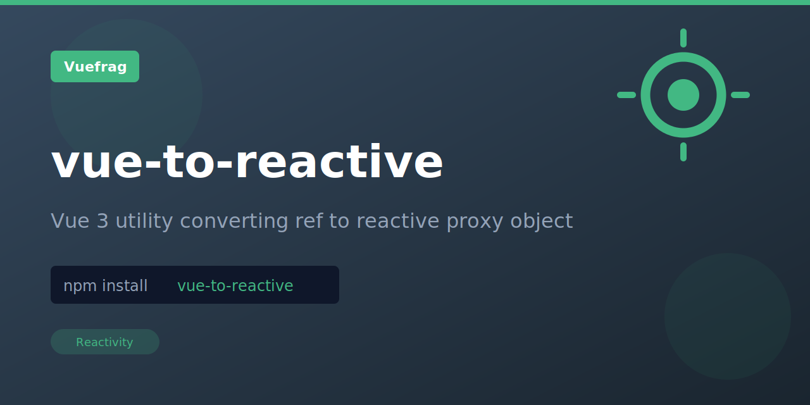

<p align="center">
  
</p>

<h1 align="center">vue-to-reactive</h1>

<p align="center">A Vue 3 composition API utility that converts a ref into a reactive proxy object, enabling direct property access without .value while maintaining full reactivity.</p>

<p align="center">
  <a href="https://www.npmjs.com/package/vue-to-reactive"></a>
  <a href="https://www.npmjs.com/package/vue-to-reactive"></a>
</p>

## Installation

```bash
npm install vue-to-reactive
```

## Usage

```ts
import { toReactive } from 'vue-to-reactive'
import { ref } from 'vue'

const refState = {
  foo: ref('bar'),
  count: ref(0)
}

const reactiveState = toReactive(refState)

console.log(reactiveState.foo) // 'bar'
console.log(reactiveState.count) // 0
```

## License

MIT

Extracted from [VueUse](https://vueuse.org/) for standalone use.
