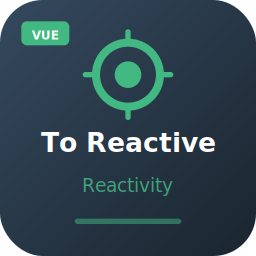

<p align="center">
  
</p>

<h1 align="center">vue-to-reactive</h1>

<p align="center"></p>

<p align="center">
  <a href="https://www.npmjs.com/package/vue-to-reactive"></a>
  <a href="https://www.npmjs.com/package/vue-to-reactive"></a>
</p>

## Installation

```bash
npm install vue-to-reactive
```

## Usage

```ts
import { toReactive } from '@vueuse/core'
import { ref } from 'vue'

const refState = ref({ foo: 'bar' })

console.log(refState.value.foo) // => 'bar'

const state = toReactive(refState) // <--

console.log(state.foo) // => 'bar'

refState.value = { bar: 'foo' }

console.log(state.foo) // => undefined
console.log(state.bar) // => 'foo'
```

## License

MIT

Extracted from [VueUse](https://vueuse.org/) for standalone use.
